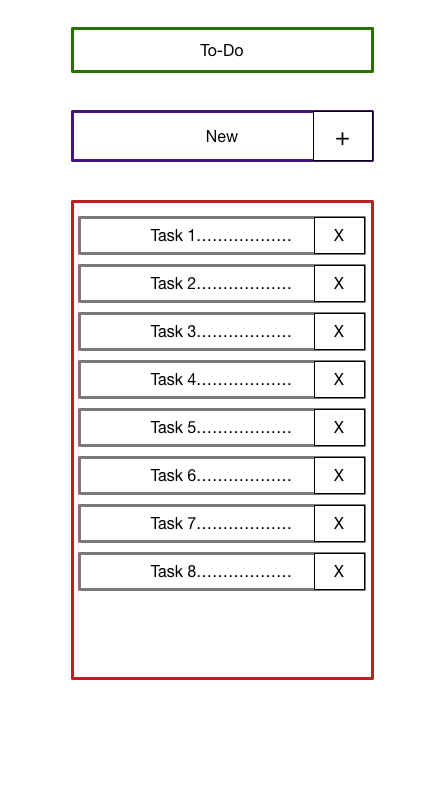

# Genius Plaza Todo App Test (React)

## Application Specification

We have created this short spec to help you create an awesome and consistent todo app. Make sure to not only read it but to understand it as well.

## Structure

### Directory Structure

Recommended file structure:

```
.gitignore
index.html
package.json
node_modules/
src/
  - components/
  - containers/
  - styles/
    └──base.scss
    └──app.scss
  - utils/
  app.js  
readme.md
```

Try to follow this structure as close as possible while still keeping React best practices.

Components should be split up into separate files and placed into folders where it makes the most sense.

A Container does data fetching and then renders its corresponding components.

Example:

```
src/
  - components/
  - containers/
  - styles/
    └──base.scss
    └──app.scss
  - utils/
  app.js  
```

### README

Your code must include a README describing the general implementation, and the build process if required. There is an example [readme](README.example.md) in this project.

### Dependency Management

Unless it conflicts with the project's best practices, your example should use [npm](https://npmjs.com) or [yarn](https://yarnpkg.com/) for package management. Specify your dependencies in a `package.json` file in the root directory of your app. An example `package.json` could look like this:

```json
{
  "private": true,
  "dependencies": {
    "backbone": "^1.1.2",
  }
}
```

You should `.gitignore` everything in `node_modules` except the files actually used by your example. That means that documentation, READMEs and tests should not be included in the pull request.

### Mockup

It is a recommended practice to have a rough visual representation of what you are about to build.



From the above diagram, try to create your own presentation components, there's no wrong answers, be creative.

### Code

Please try to keep the HTML as close to the template as possible. The `base.css` file should be referenced from the assets folder and should not be touched. If you need to change some styles, use the `app.css` file, but try to keep changes to a minimum. Remember to update the relative paths when using the template.

Make sure to follow these:

- Use double-quotes in HTML and single-quotes in JS and CSS.
- Use npm packages for your third-party dependencies and manually remove files that aren't required for your app to run.
- Use a constant instead of the keyCode directly: `var ENTER_KEY = 13;`

## Functionality

### No todos

When there are no todos, the todos list section should be hidden.

### New todo

New todos are entered in the input at the top of the app. The input element should be focused when the page is loaded, preferably by using the `autofocus` input attribute. Pressing Enter creates the todo, appends it to the todo list, and clears the input. Make sure to `.trim()` the input and then check that it's not empty before creating a new todo.

<!-- ### Mark all as complete

This checkbox toggles all the todos to the same state as itself. Make sure to clear the checked state after the "Clear completed" button is clicked. The "Mark all as complete" checkbox should also be updated when single todo items are checked/unchecked. Eg. When all the todos are checked it should also get checked. -->

### Item

A todo item has these possible interactions:

* Clicking the checkbox marks the todo as complete by updating its `completed` value and toggling the class `completed` on its parent `<li>`

<!-- 2. Double-clicking the `<label>` activates editing mode, by toggling the `.editing` class on its `<li>` -->

* Hovering over the todo shows the remove button (`.destroy`)

<!-- ### Editing

When editing mode is activated it will hide the other controls and bring forward an input that contains the todo title, which should be focused (`.focus()`). The edit should be saved on both blur and enter, and the `editing` class should be removed. Make sure to `.trim()` the input and then check that it's not empty. If it's empty the todo should instead be destroyed. If escape is pressed during the edit, the edit state should be left and any changes be discarded. -->

### Counter

Displays the number of active todos in a pluralized form. Make sure the number is wrapped by a `<strong>` tag. Also make sure to pluralize the `item` word correctly: `0 items`, `1 item`, `2 items`. Example: **2** items left

<!-- ### Clear completed button

Removes completed todos when clicked. Should be hidden when there are no completed todos. -->

<!-- ### Persistence

Your app should dynamically persist the todos to localStorage. Implement a way to add the capability of persisting data into your app. Otherwise, use vanilla localStorage. If possible, use the keys `id`, `title`, `completed` for each item. Make sure to use this format for the localStorage name: `todos-`. Editing mode should not be persisted. -->

<!-- ### Routing

Routing is required for all implementations. The following routes should be implemented: `#/` (all - default), `#/active` and `#/completed` (`#!/` is also allowed). When the route changes, the todo list should be filtered on a model level and the `selected` class on the filter links should be toggled. When an item is updated while in a filtered state, it should be updated accordingly. E.g. if the filter is `Active` and the item is checked, it should be hidden. Make sure the active filter is persisted on reload. -->

## Submit your test

Create a fork of this branch, or create a new repo called `test-react-todomvc`, please feel free to follow a good [git-flow](https://www.atlassian.com/git/tutorials/comparing-workflows/gitflow-workflow) and when you think you are ready to submit it please send an email to [david@geniusplaza.com](david@geniusplaza.com) with the url of your repository.
